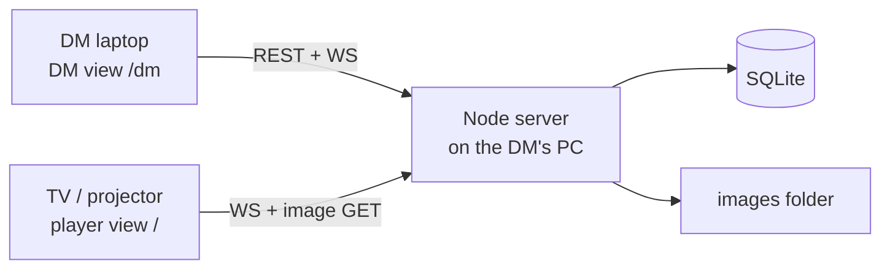

# 02 — Architecture

How the system is laid out, where it runs, and how its parts talk.

## 1. Repository layout

The repository MUST follow this layout: [D-013]

```
server/            Node server workspace
  src/http/        REST routes, static serving
  src/ws/          Socket.io handlers, rooms, role projection
  src/domain/      commands, events, undo, live state
  src/db/          SQLite access
  src/images/      upload validation, sharp variants
  migrations/      numbered SQL migrations
client/            React client workspace (both views)
  src/dm/          DM view
  src/player/      player view
  src/canvas/      react-konva map, grid, tokens
  src/ui/          shared components, message catalogue
shared/            contract types: REST bodies, commands, events
e2e/               Playwright tests
scripts/           repository tooling
specs/  docs/      specifications and inputs
```

## 2. Runtime topology

- Emberglass MUST run as one Node process on the DM's PC that serves the built React client, the REST API and the WebSocket. [input]
- Every other screen MUST connect from a browser on the LAN; the DM view uses REST and WebSocket, the player view only the WebSocket and the image files of the live scene (`07` §5). [input, Q-012]
- The server MUST listen on port 3000 by default, configurable (`09` §7); the player view is served at `/` and the DM view at `/dm`. [D-014, Q-052]



## 3. Server authority

- The server MUST be the only source of truth: clients send commands; the server checks, applies, stores and emits events. [input]
- A client MUST NOT change shared state except through a REST request or a WebSocket command that the server validates. [input]

## 4. Preparation over REST, play over WebSocket

- Library, campaigns, sessions and scene setup MUST be REST CRUD; the WebSocket MUST carry only the live scene. [input]
- The scene being edited is independent of the live scene; changes to a scene that is not live MUST NOT be sent to any client other than the DM view making them. [input]
- A REST change to the live scene's setup (map image, grid) MUST be followed by a fresh snapshot to both rooms (`04` §10). [Q-015, recommendation accepted]

## 5. REST resources

The REST API MUST be served under `/api`, with JSON bodies validated against schemas derived from the `shared` contract types. [D-015]

The REST API MUST offer these resources and operations: [input, Q-001, Q-007, Q-051, Q-058, Q-085]

| Resource | Operations |
| --- | --- |
| `/api/auth` | enter PIN, leave, current role (`07` §2) |
| `/api/setup` | first-run PIN setup, localhost only (`07` §1) |
| `/api/images` | upload, read metadata, update grid preset |
| `/api/assets` | list with search and tag filter, create, update, delete, list usages |
| `/api/campaigns`, `/api/campaigns/:id/sessions` | CRUD, ordering |
| `/api/sessions/:id/scenes` | CRUD, ordering, duplicate |
| `/api/scenes/:id` | setup (map, grid), tokens while not live |
| `/api/settings` | ruler rule, upload limit, display variant size, PIN change |

Every `/api` route except `/api/auth` (PIN entry) and `/api/setup` MUST require a DM session (`07` §2). [Q-046]

## 6. Offline operation

- The running application MUST NOT send any request to a host outside the LAN: no telemetry, no update check, no CDN. [Q-020]
- Code, fonts and icons MUST be bundled so that both views work with no internet connection. [Q-020]

## 7. Storage

- State MUST be stored in one SQLite database plus one images folder, both inside one data directory (`09` §5). [input, Q-039]
- Image files MUST be named by the sha256 of the original upload (`05` §7). [input]
- Backing up MUST require nothing more than copying the data directory. [input]

## 8. Future packaging

Phase 3 wraps the same server and client in Tauri or Electron without changing this architecture (`01` §5). [input] 

The MVP MUST NOT assume a browser-only deployment in a way that such a wrapper could not host; no packaging work is done now. [Q-049]
