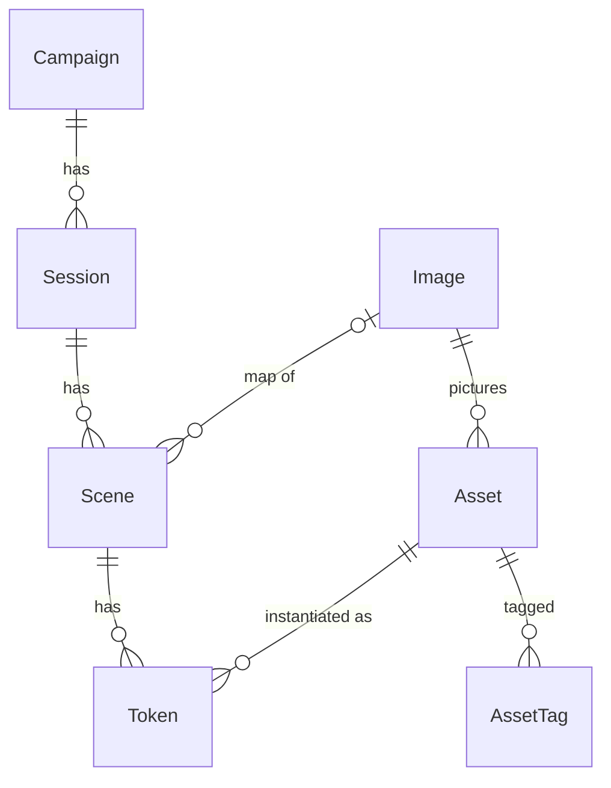

# 03 — Domain Model

The stored entities, how they relate, and what deleting them does.

## 1. Entities

The MVP MUST store exactly these eight entities in SQLite: [input]

| Entity | Key fields | Notes |
| --- | --- | --- |
| Image | `id` = sha256, `mime`, `width`, `height`, `variants`, `grid_preset` | duplicates recognised by hash (`05` §7) |
| Asset | `name`, `category`, `image_id`, `size`, `default_hidden`, `notes` | shared library for all campaigns (`05` §1) |
| AssetTag | `asset_id`, `tag` | free tags for filtering and search |
| Campaign | `name`, `description`, `rules_version` | `rules_version = 5e-2014` |
| Session | `campaign_id`, `title`, `order`, `date` | |
| Scene | `session_id`, `name`, `order`, `map_image_id`, `grid` | grid: `type`, `size`, `offset_x`, `offset_y`, `visible`, `feet_per_square`, `columns`, `rows` (`06` §2) |
| Token | `scene_id`, `asset_id`, `label`, `x`, `y`, `hidden`, `z_order`, `character_id` | `character_id` empty in the MVP |
| Settings | `live_scene_id`, ruler rule, upload limit, display variant size, PIN hash | one game per server |

## 2. Relationships

- A token MUST reference exactly one scene and one asset; an asset is the template, a token its instance on a scene. [input]
- A scene MAY have no map image; `map_image_id` is nullable. [Q-006]
- Sessions within a campaign and scenes within a session MUST keep a DM-defined `order`. [input]

## 3. Identifiers

- Every entity except Image MUST be identified by a UUID generated by the server, so that data from another PC never collides. [input]
- An Image MUST be identified by the sha256 of its original bytes; uploading the same bytes again MUST reuse the existing Image. [input]

## 4. Token position

- Token `x` and `y` MUST be stored in grid units as decimals, not pixels. [input]
- Changing a scene's calibration or its map's resolution MUST NOT change any token's stored position. [input]

## 5. Grid presets

- A new scene with a map MUST start with a copy of that image's grid preset. [Q-001]
- Calibrating a scene's grid MUST also update its image's preset, so scenes created later start from it. [Q-001]
- Calibrating one scene MUST NOT change the grid of any other existing scene. [Q-001]

## 6. Scenes without a map

- A scene without a map MUST store its grid extent as `columns` × `rows`. [Q-006]
- The default extent is 30 × 20 on a neutral dark background; a map MAY be attached later, after which the grid is calibrated to it. [D-016]

## 7. Deletion and duplication

- Deleting a session MUST delete its scenes and their tokens. [input]
- Deleting a scene MUST delete its tokens. [input]
- Deleting a campaign MUST delete its sessions, scenes and tokens, after a confirmation that states what will be removed. [Q-003]
- Deleting an asset used by any token MUST be refused, with the list of scenes that use it. [input]
- Every deletion is permanent once confirmed; there is no trash and no restore outside the live-scene undo (`04` §8). [Q-004]
- When no asset and no scene references an image any more, its files and its grid preset MUST be removed. [Q-002]
- Deleting the live scene, or a session or campaign that contains it, MUST be allowed after a confirmation that warns it is live, and MUST clear the live scene so the player view shows the idle screen (`08` §4). [Q-031, recommendation accepted]
- Changing an asset's image MUST change the image of every token of that asset. [input]
- Duplicating a scene MUST create a new scene with its own copies of all its tokens. [input]

## 8. Prepared for later phases

- `Token.character_id` MUST exist and MUST stay empty in the MVP; Phase 2 links tokens to characters through it. [input]
- `grid.type` MUST exist and MUST accept only `square` in the MVP. [input]
- `Campaign.rules_version` MUST be `5e-2014` for every campaign in the MVP. [input]
