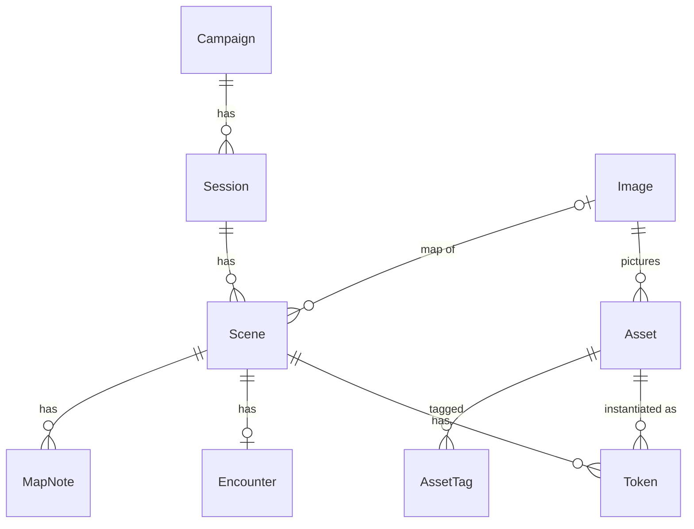

# 03 — Domain Model

The stored entities, how they relate, and what deleting them does.

## 1. Entities

The MVP MUST store exactly these ten entities in SQLite: [input, Q-006, Q-037, Q-042, Q-051, Q-091, Q-099, Q-111, Q-112, Q-114, Q-119, Q-128]

| Entity | Key fields | Notes |
| --- | --- | --- |
| Image | `id` = sha256, `mime`, `width`, `height`, `variants`, `grid_preset` | duplicates recognised by hash (`05` §7) |
| Asset | `name`, `category`, `image_id`, `size`, `default_hidden`, `notes`, `hp_max`, `ac` | shared library for all campaigns (`05` §1); `hp_max` and `ac`: optional defaults copied to its new tokens (§9) |
| AssetTag | `asset_id`, `tag` | free tags for filtering and search |
| Campaign | `name`, `description`, `rules_version` | `rules_version = 5e-2014` |
| Session | `campaign_id`, `title`, `order`, `date` | |
| Scene | `session_id`, `name`, `order`, `map_image_id`, `grid`, `token_numbers`, `fog`, `notes` | grid: `type`, `size`, `offset_x`, `offset_y`, `visible`, `feet_per_square`, `columns`, `rows` (`06` §2); token numbers: the highest number issued per asset on the scene, never sent to a client (`05` §3); fog: the fog the DM painted (`01` §9), cells of a quarter square in grid units, players seeing neither them nor the tokens whose centre they cover (`04` §4, §13), sent only in a live snapshot and its events and, to the DM, over its own route; notes: the DM's (§10) |
| Token | `scene_id`, `asset_id`, `label`, `x`, `y`, `hidden`, `z_order`, `markers`, `shown`, `character_id`, `hp_current`, `hp_max`, `hp_temp`, `ac`, `notes` | `character_id` empty in the MVP; `shown`: whether players have seen the token, set when it is first shown and never cleared, never sent to a client (`05` §3); `markers`: the condition markers it carries, each condition at most once, in the order applied, Exhaustion with its level from 1 to 6 (`01` §9, Q-103); hit points and armour class optional (§9), notes the DM's (§10) |
| Encounter | `scene_id`, `active`, `round`, `current_index`, `enemies_seen`, `entries` | at most one per scene (`04` §14); `entries` in turn order, each a player character's (`kind: pc`) or a monster's or npc's (`kind: monster`), naming its token (`token_id`), with its initiative number or none; `enemies_seen`: whether the encounter has had a monster or npc entry that could take its turn, never sent to players (Q-111, Q-118) |
| MapNote | `scene_id`, `x`, `y`, `notes` | a note the DM pins at a point of a scene's map (`01` §11, Q-128): the point in grid units, as a token's position (§4), the icon's centre; notes the DM's (§10) |
| Settings | `live_scene_id`, ruler rule, upload limit, display variant size, TV address, import limit, PIN hash | one game per server; the TV address is an IPv4 address the DM chose for the connect panel, or none for Automatic (`08` §5, Q-110); the import limit bounds an archive and its unpacked entries (`09` §9, Q-119) |

## 2. Relationships

```mermaid
erDiagram
  Campaign ||--o{ Session : has
  Session ||--o{ Scene : has
  Scene ||--o{ Token : has
  Scene ||--o| Encounter : has
  Scene ||--o{ MapNote : has
  Asset ||--o{ Token : "instantiated as"
  Asset ||--o{ AssetTag : tagged
  Image ||--o{ Asset : pictures
  Image |o--o{ Scene : "map of"
```

- A token MUST reference exactly one scene and one asset; an asset is the template, a token its instance on a scene. [input]
- A scene MAY have no map image; `map_image_id` is nullable. [Q-006]
- A scene MUST hold one painted fog, none on a new scene; the fog regions of TBL-03 are no longer an entity. [D-154]
- An encounter MUST reference exactly one scene, and each of its entries a token of that scene. [Q-111]
- Sessions within a campaign and scenes within a session MUST keep an `order`. [input]

## 3. Identifiers

- Every entity except Image MUST be identified by a UUID, so that data from another PC never collides. [input]
- UUIDs MUST be generated by the server. [Q-055]
- An Image MUST be identified by the sha256 of its original bytes; uploading the same bytes again MUST reuse the existing Image. [input]

## 4. Token position

- Token `x` and `y` MUST be stored in grid units as decimals, not pixels. [input]
- Changing a scene's calibration or its map's resolution MUST NOT change any token's stored position. [input]

## 5. Grid presets

- A new scene with a map MUST start with a copy of that image's grid preset. [Q-001]
- Calibrating a scene's grid MUST also update its image's preset, so scenes created later start from it. [Q-001]
- Calibrating one scene MUST NOT change the grid of any other existing scene. [Q-001]

## 6. Scenes without a map

- A scene without a map MUST store its grid extent as `columns` × `rows`. [Q-006]
- The default extent is 30 × 20 on a neutral dark background; a map MAY be attached later, after which the grid is calibrated to it. [Q-034]

## 7. Deletion and duplication

- Deleting a session MUST delete its scenes and their tokens. [input]
- Deleting a scene MUST delete its tokens, its fog, its encounter and its map notes. [input, D-139, D-154, Q-111, Q-128]
- Deleting a token MUST remove its initiative entry. [Q-111]
- Deleting a campaign MUST delete its sessions, scenes and tokens, after a confirmation that states what will be removed. [Q-003]
- Deleting an asset used by any token MUST be refused, with the list of scenes that use it. [input]
- Every deletion is permanent once confirmed; there is no trash and no restore outside the live-scene undo (`04` §8). [Q-004]
- When no asset and no scene references an image any more, its files and its grid preset MUST be removed. [Q-002]
- Deleting the live scene, or a session or campaign that contains it, MUST be allowed after a confirmation that warns it is live, and MUST clear the live scene so the player view shows the idle screen (`08` §4). [Q-031, recommendation accepted]
- Changing an asset's image MUST change the image of every token of that asset. [input]
- Duplicating a scene MUST create a new scene with its own copies of all its tokens, their hit points, armour class and notes included, its fog, its notes and its map notes, and no encounter. [input, D-139, D-154, Q-111, Q-112, Q-114, Q-128]

## 8. Prepared for later phases

- `Token.character_id` MUST exist and MUST stay empty in the MVP; Phase 2 links tokens to characters through it. [input]
- `grid.type` MUST exist and MUST accept only `square` in the MVP. [input]
- `Campaign.rules_version` MUST be `5e-2014` for every campaign in the MVP. [input]

## 9. Hit points and armour class

- Every token, whatever its category, MUST carry `hp_current`, `hp_max`, `hp_temp` and `ac`, each a whole number or none, none by default; the DM MAY fill any of them, player characters' included. [Q-112]
- An asset MAY carry a default `hp_max` and `ac`, copied to every new token placed from it. [Q-112]
- A token placed from such an asset starts with its `hp_current` equal to that `hp_max` and no temporary hit points; a later change of the asset's defaults changes no existing token. [D-181]
- A token's hit points and armour class and an asset's defaults MUST be seen only by the DM (`04` §4); the automation they drive is `04` §15. [Q-112]

## 10. DM notes

- Every scene and every token MUST carry a `notes` text, empty by default, seen only by the DM (`04` §4, `04` §16). [Q-114]
- Wherever the DM reads or edits a token's notes, its asset's `notes` MUST be shown beside them, read-only. [Q-114]
- A scene MAY carry map notes, each a `notes` text at a point of its map, seen only by the DM (`04` §4, `04` §16, `08` §14). [Q-128]
