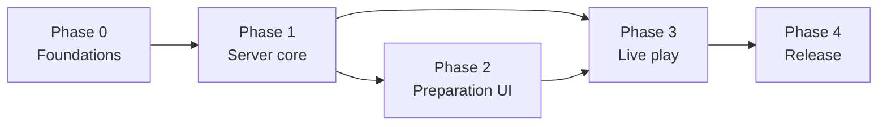

# Implementation Plan for GenAI SWE Agents

## 1. Delivery strategy

Implement in thin, testable vertical increments. GenAI agents work best with bounded tasks, explicit inputs, a small file surface and executable acceptance criteria. Avoid parallel edits to shared foundations such as migrations, contract root files and global authorization middleware.

Each phase ends with a running integrated system. Work packages are relative units of work, not calendar promises. Every package has a row in `TRACEABILITY.md`; a package is `done` only when its acceptance ran and passed.

## 2. Dependency overview

## 3. Phase 0 — Foundations

Goal: a reproducible repository, one command that runs every gate, CI that runs only those commands, and the shared contracts, before any domain work.

### Work packages

`FND-01` Command contract and repository scaffold

- Make every target of the root `Makefile` real, replacing the failing placeholder bodies the documentation pack ships with: `setup`, `infra-up`, `infra-status`, `infra-down`, `migrate`, `dev`, `test`, `lint`, `format`, `format-check`, `typecheck`, `e2e`, `build`, `verify`, `smoke`, `audit`, `scan-secrets`, `clean-start`. `check-docs` is already real and stays green.
- Create the `server`, `client` and `shared` npm workspaces, the `e2e` Playwright project and the layout of `02` §1; Node 24 pinned (`09` §1).
- No local infrastructure: `infra-up`, `infra-status` and `infra-down` succeed and state that there are no services; `migrate` applies SQLite migrations to the configured data directory; lockfiles committed.
- `make verify` runs every gate the testing specification requires that exists at this point; `make clean-start` proves a fresh clone boots, verifies and tears down.
- Surfaces: scope
- Touches red line: no
- Contract change: no

`FND-02` CI baseline

- A pipeline on the project's remote, running on every merge request and every push to the default branch, on Linux and Windows runners (`10` §4), against a real SQLite file, never a mock (`10` §2).
- Every job runs exactly one `Makefile` target, so "CI is green" and "`make verify` is green" are the same statement; `README.md` maps job to command.
- `make check-docs` runs as its own job.
- Every gate the testing specification requires but nothing implements yet is a failing-forward tripwire: a job that passes only while the gate is provably absent and fails with promotion instructions the moment it becomes runnable. A missing gate and a silently passing gate must never look alike.
- Dependency and secret scanning; artifact and cache strategy; no job retries.
- Surfaces: scope
- Touches red line: yes
- Contract change: no

`FND-03` API and WebSocket conventions

- `/api` base path, JSON schemas derived from the `shared` types, and one error envelope for REST (`02` §5).
- Typed command and event envelopes for Socket.io in `shared`, with version numbers (`04` §2, `04` §3, `04` §5).
- Structured logging to console and rotating file, with the exclusions of `07` §8.
- Surfaces: security, scope, ux
- Touches red line: yes
- Contract change: yes

<!-- if:UI -->
`FND-04` Design, accessibility and localization foundation

- Shared tokens and base components, focus and error patterns, the DM and player view shells at `/dm` and `/` (`02` §2).
- English message catalogue with no hard-coded UI strings (`08` §6).
- A keyboard-operability smoke test for core DM actions wired as a real gate (`08` §8).
- Every font and icon bundled locally (`02` §6).
- Surfaces: external, ux
- Touches red line: yes
- Contract change: no

### Exit criteria

A fresh clone boots locally through `make clean-start`; CI is green on the remote and a red pipeline blocks a merge; `make check-docs` passes; every tripwire is either promoted or still provably absent.<!-- if:API --> Both clients call the health endpoint through the generated client and a controlled error carries a correlation ID.
## 4. Phase 1 — Server core

Goal: the server stores and serves everything the DM prepares, behind the PIN, with images processed on upload.

### Work packages

`SRV-01` Schema and migrations

- The eight entities, identifiers, nullable map and grid extent, prepared fields (`03` §1, `03` §2, `03` §3, `03` §6, `03` §8).
- Token positions in grid units (`03` §4).
- Surfaces: data
- Touches red line: yes
- Contract change: yes

`SRV-02` PIN, DM session and guessing protection

- First-run setup from loopback only, PIN change ending other sessions, `npm run reset-pin` (`07` §1, `07` §2).
- Numeric PIN with per-client lockout; Origin checks; role derived only from the session (`07` §6, `07` §7).
- Every `/api` route except PIN entry and setup requires a DM session (`02` §5).
- Surfaces: security
- Touches red line: yes
- Contract change: yes

`SRV-03` Campaigns, sessions and scenes over REST

- CRUD and ordering, scene duplication, deletion cascades with confirmation data, live-scene deletion clearing the live pointer (`03` §7).
- Grid presets copied on scene creation and updated on calibration (`03` §5).
- Surfaces: data
- Touches red line: yes
- Contract change: yes

`SRV-04` Image upload pipeline

- Content-type validation and size limit with explicit rejections (`05` §6).
- sha256 identity and reuse, original, display and thumbnail variants, display-size setting with background regeneration (`05` §7).
- Removal of unreferenced images (`03` §7).
- Surfaces: data, security, scope
- Touches red line: yes
- Contract change: yes

`SRV-05` Asset library over REST

- Assets, categories, sizes, tags, notes, default visibility, search and filters (`05` §1, `05` §2, `05` §4).
- Usage listing and refusal to delete an asset in use; image change propagating to tokens (`05` §5).
- Surfaces: —
- Touches red line: no
- Contract change: yes

### Exit criteria

Integration tests against a real SQLite file cover every REST resource, every deletion rule and every upload rejection; a request without a DM session is refused on every protected route.

## 5. Phase 2 — Preparation UI

Goal: the DM prepares a whole session in the browser: campaigns, scenes, calibrated grids and placed tokens.

### Work packages

`PRP-01` DM workspace shell

- Scene tree sidebar, library panel, live bar, PIN entry and first-run screens (`08` §1, `07` §1).
- Surfaces: security, ux
- Touches red line: yes
- Contract change: no

`PRP-02` Canvas and grid overlay

- Map background with zoom and pan in both views, grid overlay with player visibility, map-less scenes (`08` §3, `06` §2, `03` §6).
- Surfaces: data
- Touches red line: yes
- Contract change: no

`PRP-03` Grid calibration

- The three methods with live overlay, decimal square size, far-corner magnifier, original-dimension storage (`06` §1, `06` §2).
- Presets per image (`06` §3).
- Surfaces: data
- Touches red line: yes
- Contract change: no

`PRP-04` Tokens in preparation

- Add flow through the picker, automatic numbering, sizes, default visibility (`05` §3, `05` §4, `05` §5).
- Drag with snap and Alt free placement; hide, reveal, delete, label and stacking order on scenes that are not live (`06` §4, `04` §2).
- Surfaces: security, scope, ux
- Touches red line: yes
- Contract change: no

### Exit criteria

An end-to-end test prepares a campaign with a mapped scene calibrated by each method, a map-less scene, and numbered tokens, some hidden, and reloads it unchanged.

## 6. Phase 3 — Live play

Goal: the DM runs a prepared session on the TV with hidden information never leaving the server.

### Work packages

`LIV-01` WebSocket rooms, snapshots and reconnection

- `dm` and `players` rooms from the session cookie, role-filtered snapshots, version numbers and gap recovery (`04` §1, `04` §5).
- Automatic reconnection without a PIN prompt (`04` §6).
- Surfaces: security
- Touches red line: no
- Contract change: yes

`LIV-02` Live commands and role projection

- `token.add`, `token.move`, `token.setVisibility`, `token.delete`, last-write-wins, rejection of player commands (`04` §2).
- Server-side filtering, reveal as add and hide as remove, player field allowlist with labels (`04` §3, `04` §4).
- Image entitlement for players following the live scene (`07` §5).
- Surfaces: security, scope, ux
- Touches red line: yes
- Contract change: yes

`LIV-03` Player view and connecting a screen

- Idle screen, fit-to-map on activation, rendering of visible tokens and labels, no controls (`08` §4, `08` §9).
- Console and "Connect a screen" QR and URL for the player view; LAN address listing (`08` §5).
- Surfaces: ux
- Touches red line: no
- Contract change: no

`LIV-04` Live and prep modes

- One canvas with live indicator, live bar return, "Go live" and "Blank TV" (`08` §2, `04` §2).
- Setup edits on the live scene pushed as snapshots (`04` §10).
- Surfaces: security, scope, ux
- Touches red line: yes
- Contract change: yes

`LIV-05` Undo

- In-memory inverse history for the live scene, Ctrl+Z through the normal command path, bounded and cleared on activation (`04` §8).
- Surfaces: data
- Touches red line: no
- Contract change: yes

`LIV-06` Cameras

- Independent cameras, the TV frame in the DM view, player camera steering and reset on activation (`04` §9).
- Surfaces: ux
- Touches red line: no
- Contract change: yes

`LIV-07` Ruler

- Two-point ruler with PHB and DMG diagonal rules and feet per square, shown on the TV for the live scene (`06` §5, `04` §11).
- Surfaces: ux
- Touches red line: no
- Contract change: yes

### Exit criteria

The hidden-information suite of `10` §3 passes, and the run journey of `10` §5 passes end to end with a DM context and a player context.

## 7. Phase 4 — Release

Goal: a DM can install, run, back up and trust the MVP on their own PC and TV.

### Work packages

`REL-01` Operations and repository documents

- `npm install` / `npm start`, start-up output, migrations at start, data directory, configuration, logging (`09` §1, `09` §2, `09` §5, `09` §6, `09` §7).
- Settings screen for upload limit, display size and ruler rule (`09` §7).
- README with firewall guidance, network exposure and naming, `LICENSE` (`09` §4, `09` §8).
- Surfaces: data, security, scope, external
- Touches red line: yes
- Contract change: yes

`REL-02` Acceptance suite and system matrix

- Acceptance scenarios, offline run and external-URL build check, large-scene fixture (`10` §3, `10` §5, `10` §6).
- Server acceptance on Windows and Linux; browser matrix for both views (`10` §4).
- Surfaces: security, scope, external
- Touches red line: yes
- Contract change: no

`REL-03` Acceptance on the owner's TV

- The player view accepted on the owner's LG TV built-in browser with the large-scene fixture; display-size default confirmed or changed (`10` §4, `05` §7).
- Surfaces: scope
- Touches red line: no
- Contract change: no

### Exit criteria

Every acceptance scenario of `10` §5 passes on Windows and Linux, the offline run passes, and the LG TV run is recorded with its result.

## 8. Safe parallelization

After a phase's shared model and contracts are merged, agents may work concurrently on low-overlap packages. Never parallelize migrations for the same aggregate, or concurrent edits to central policies or the contract root, without explicit ownership.

Suggested maximum lanes:

- server REST and data (`server/src/http`, `server/src/db`, `server/src/images`);
- live protocol (`server/src/ws`, `server/src/domain`, `shared`);
- DM view (`client/src/dm`, `client/src/canvas`);
- player view (`client/src/player`);
- end-to-end tests and CI (`e2e`, pipeline).

Each lane uses a branch or worktree and integrates through small reviewed merges.

## 9. Backlog discipline

Each ticket MUST include spec references, dependency and allowed file surface, contract and schema impact, acceptance tests and explicit exclusions. [input]

If a ticket reveals a locked-decision conflict, stop and create an ADR; do not improvise a redesign.
