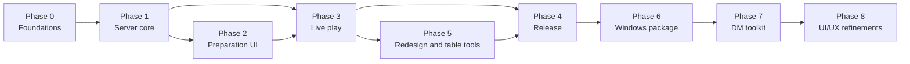

# Implementation Plan for GenAI SWE Agents

## 1. Delivery strategy

Implement in thin, testable vertical increments. GenAI agents work best with bounded tasks, explicit inputs, a small file surface and executable acceptance criteria. Avoid parallel edits to shared foundations such as migrations, contract root files and global authorization middleware.

Each phase ends with a running integrated system. Work packages are relative units of work, not calendar promises. Every package has a row in `TRACEABILITY.md`; a package is `done` only when its acceptance ran and passed.

## 2. Dependency overview

```mermaid
flowchart LR
  P0["Phase 0<br/>Foundations"] --> P1["Phase 1<br/>Server core"]
  P1 --> P2["Phase 2<br/>Preparation UI"]
  P1 --> P3["Phase 3<br/>Live play"]
  P2 --> P3
  P3 --> P4["Phase 4<br/>Release"]
  P3 --> P5["Phase 5<br/>Redesign and table tools"]
  P5 --> P4
  P4 --> P6["Phase 6<br/>Windows package"]
  P6 --> P7["Phase 7<br/>DM toolkit"]
  P7 --> P8["Phase 8<br/>UI/UX refinements"]
```

Phase 5 was added after Phases 0 to 3 and REL-01, REL-02 were done (Q-099, Q-100): it runs before REL-03, so the owner's TV run accepts what ships.

Phase 6 was added after every earlier package was done (Q-107): it packages what Phase 4 accepted, and its exit criteria join the release gate.

Phase 7 was added after every earlier package was done (Q-111 to Q-119): its packages run in order, hit points first because per-enemy initiative passes over a monster its hit points made Dead, and export and import last so that its format carries every field the others add.

Phase 8 was added while Phase 7 awaited its review (Q-121 to Q-125, then Q-126 to Q-128): its packages change no stored data, and the one contract change, `token.batch`, is covered by the hidden-information suite.

## 3. Phase 0 — Foundations

Goal: a reproducible repository, one command that runs every gate, CI that runs only those commands, and the shared contracts, before any domain work.

### Work packages

`FND-01` Command contract and repository scaffold

- Make every target of the root `Makefile` real, replacing the failing placeholder bodies the documentation pack ships with: `setup`, `infra-up`, `infra-status`, `infra-down`, `migrate`, `dev`, `test`, `lint`, `format`, `format-check`, `typecheck`, `e2e`, `build`, `verify`, `smoke`, `audit`, `scan-secrets`, `clean-start`. `check-docs` is already real and stays green.
- Create the `server`, `client` and `shared` npm workspaces, the `e2e` Playwright project and the layout of `02` §1; Node 24 pinned (`09` §1).
- No local infrastructure: `infra-up`, `infra-status` and `infra-down` succeed and state that there are no services; `migrate` applies SQLite migrations to the configured data directory; lockfiles committed.
- `make verify` runs every gate the testing specification requires that exists at this point; `make clean-start` proves a fresh clone boots, verifies and tears down.
- Surfaces: scope
- Touches red line: no
- Contract change: no

`FND-02` CI baseline

- A pipeline on the project's remote, running on every merge request and every push to the default branch, on Linux and Windows runners (`10` §4), against a real SQLite file, never a mock (`10` §2); GitHub with GitHub Actions. [Q-066, recommendation accepted]
- Every job runs exactly one `Makefile` target, so "CI is green" and "`make verify` is green" are the same statement; `README.md` maps job to command.
- `make check-docs` runs as its own job.
- Every gate the testing specification requires but nothing implements yet is a failing-forward tripwire: a job that passes only while the gate is provably absent and fails with promotion instructions the moment it becomes runnable. A missing gate and a silently passing gate must never look alike.
- Dependency and secret scanning; artifact and cache strategy; no job retries.
- Surfaces: scope
- Touches red line: yes
- Contract change: no

`FND-03` API and WebSocket conventions

- `/api` base path, JSON schemas derived from the `shared` types, and one error envelope for REST (`02` §5).
- Typed command and event envelopes for Socket.io in `shared`, with version numbers (`04` §2, `04` §3, `04` §5).
- Structured logging to console and rotating file, with the exclusions of `07` §8.
- Surfaces: data, security, scope, ux
- Touches red line: yes
- Contract change: yes

`FND-04` Design, accessibility and localization foundation

- Shared tokens and base components, focus and error patterns, the DM and player view shells at `/dm` and `/` (`02` §2).
- English message catalogue with no hard-coded UI strings (`08` §6).
- A keyboard-operability smoke test for core DM actions wired as a real gate (`08` §8).
- Every font and icon bundled locally (`02` §6).
- Surfaces: security, external, ux
- Touches red line: yes
- Contract change: no

### Exit criteria

A fresh clone boots locally through `make clean-start`; CI is green on the remote and a red pipeline blocks a merge; `make check-docs` passes; every tripwire is either promoted or still provably absent. A REST error and a rejected WebSocket command both arrive in the shared envelope.
## 4. Phase 1 — Server core

Goal: the server stores and serves everything the DM prepares, behind the PIN, with images processed on upload.

### Work packages

`SRV-01` Schema and migrations

- The eight entities, identifiers, nullable map and grid extent, prepared fields (`03` §1, `03` §2, `03` §3, `03` §6, `03` §8).
- Token positions in grid units (`03` §4).
- Surfaces: data, scope
- Touches red line: yes
- Contract change: yes

`SRV-02` PIN, DM session and guessing protection

- First-run setup from loopback only, PIN change ending other sessions, `npm run reset-pin` (`07` §1, `07` §2).
- Numeric PIN with per-client lockout; Origin checks; role derived only from the session (`07` §6, `07` §7).
- Every `/api` route except PIN entry and setup requires a DM session (`02` §5).
- Surfaces: data, security
- Touches red line: yes
- Contract change: yes

`SRV-03` Campaigns, sessions and scenes over REST

- CRUD and ordering, scene duplication, deletion cascades with confirmation data, live-scene deletion clearing the live pointer (`03` §7).
- Grid presets copied on scene creation and updated on calibration (`03` §5).
- Surfaces: data, scope
- Touches red line: yes
- Contract change: yes

`SRV-04` Image upload pipeline

- Content-type validation and size limit with explicit rejections (`05` §6).
- sha256 identity and reuse, original, display and thumbnail variants, display-size setting with background regeneration (`05` §7).
- Removal of unreferenced images (`03` §7).
- Surfaces: data, security, scope
- Touches red line: yes
- Contract change: yes

`SRV-05` Asset library over REST

- Assets, categories, sizes, tags, notes, default visibility, search and filters (`05` §1, `05` §2, `05` §4).
- Usage listing and refusal to delete an asset in use; image change propagating to tokens (`05` §5).
- Surfaces: data, security, ux
- Touches red line: no
- Contract change: yes

### Exit criteria

Integration tests against a real SQLite file cover every REST resource, every deletion rule and every upload rejection; a request without a DM session is refused on every protected route.

## 5. Phase 2 — Preparation UI

Goal: the DM prepares a whole session in the browser: campaigns, scenes, calibrated grids and placed tokens.

### Work packages

`PRP-01` DM workspace shell

- Scene tree sidebar, library panel, live bar, PIN entry and first-run screens (`08` §1, `07` §1).
- Surfaces: security, ux
- Touches red line: yes
- Contract change: no

`PRP-02` Canvas and grid overlay

- Map background with zoom and pan in both views, grid overlay with player visibility, map-less scenes (`08` §3, `06` §2, `03` §6).
- Surfaces: data, ux
- Touches red line: yes
- Contract change: no

`PRP-03` Grid calibration

- The three methods with live overlay, decimal square size, far-corner magnifier, original-dimension storage (`06` §1, `06` §2).
- Presets per image (`06` §3).
- Surfaces: data
- Touches red line: yes
- Contract change: no

`PRP-04` Tokens in preparation

- Add flow through the picker, automatic numbering, sizes, default visibility (`05` §3, `05` §4, `05` §5).
- Drag with snap and Alt free placement; hide, reveal, delete, label and stacking order on scenes that are not live (`06` §4, `04` §2).
- Surfaces: data, security, scope, ux
- Touches red line: yes
- Contract change: no

### Exit criteria

An end-to-end test prepares a campaign with a mapped scene calibrated by each method, a map-less scene, and numbered tokens, some hidden, and reloads it unchanged.

## 6. Phase 3 — Live play

Goal: the DM runs a prepared session on the TV with hidden information never leaving the server.

### Work packages

`LIV-01` WebSocket rooms, snapshots and reconnection

- `dm` and `players` rooms from the session cookie, role-filtered snapshots, version numbers and gap recovery (`04` §1, `04` §5).
- Automatic reconnection without a PIN prompt (`04` §6).
- Surfaces: data, security
- Touches red line: no
- Contract change: yes

`LIV-02` Live commands and role projection

- `token.add`, `token.move`, `token.setVisibility`, `token.delete`, last-write-wins, rejection of player commands (`04` §2).
- Server-side filtering, reveal as add and hide as remove, player field allowlist with labels (`04` §3, `04` §4).
- Image entitlement for players following the live scene (`07` §5).
- Surfaces: data, security, scope, ux
- Touches red line: yes
- Contract change: yes

`LIV-03` Player view and connecting a screen

- Idle screen, fit-to-map on activation, rendering of visible tokens and labels, no controls (`08` §4, `08` §9).
- Console and "Connect a screen" QR and URL for the player view; LAN address listing (`08` §5).
- Surfaces: data, security, scope, ux
- Touches red line: no
- Contract change: no

`LIV-04` Live and prep modes

- One canvas with live indicator, live bar return, "Go live" and "Blank TV" (`08` §2, `04` §2).
- Setup edits on the live scene pushed as snapshots (`04` §10).
- Surfaces: data, security, scope, ux
- Touches red line: yes
- Contract change: yes

`LIV-05` Undo

- In-memory inverse history for the live scene, Ctrl+Z through the normal command path, bounded and cleared on activation (`04` §8).
- Surfaces: data, scope
- Touches red line: no
- Contract change: yes

`LIV-06` Cameras

- Independent cameras, the TV frame in the DM view, player camera steering and reset on activation (`04` §9).
- Surfaces: data, ux
- Touches red line: no
- Contract change: yes

`LIV-07` Ruler

- Two-point ruler with PHB and DMG diagonal rules and feet per square, shown on the TV for the live scene (`06` §5, `04` §11).
- Surfaces: data, security, scope, ux
- Touches red line: no
- Contract change: yes

### Exit criteria

The hidden-information suite of `10` §3 passes, and the run journey of `10` §5 passes end to end with a DM context and a player context.

## 7. Phase 4 — Release

Goal: a DM can install, run, back up and trust the MVP on their own PC and TV.

### Work packages

`REL-01` Operations and repository documents

- `npm install` / `npm start`, start-up output, migrations at start, data directory, configuration, logging (`09` §1, `09` §2, `09` §5, `09` §6, `09` §7).
- Settings screen for upload limit, display size and ruler rule (`09` §7).
- README with firewall guidance, network exposure and naming, `LICENSE` (`09` §4, `09` §8).
- Surfaces: data, security, scope, external, ux
- Touches red line: yes
- Contract change: yes

`REL-02` Acceptance suite and system matrix

- Acceptance scenarios, offline run and external-URL build check, large-scene fixture (`10` §3, `10` §5, `10` §6).
- Server acceptance on Windows and Linux; browser matrix for both views (`10` §4).
- Surfaces: security, scope, external
- Touches red line: yes
- Contract change: no

`REL-03` Acceptance on the owner's TV

- The player view accepted on the owner's LG TV built-in browser with the large-scene fixture; display-size default confirmed or changed (`10` §4, `05` §7).
- Surfaces: data, security, scope
- Touches red line: no
- Contract change: no

### Exit criteria

Every acceptance scenario of `10` §5 passes on Windows and Linux, the offline run passes, and the LG TV run is recorded with its result.

## 8. Safe parallelization

After a phase's shared model and contracts are merged, agents may work concurrently on low-overlap packages. Never parallelize migrations for the same aggregate, or concurrent edits to central policies or the contract root, without explicit ownership.

Suggested maximum lanes:

- server REST and data (`server/src/http`, `server/src/db`, `server/src/images`);
- live protocol (`server/src/ws`, `server/src/domain`, `shared`);
- DM view (`client/src/dm`, `client/src/canvas`);
- player view (`client/src/player`);
- end-to-end tests and CI (`e2e`, pipeline).

Each lane uses a branch or worktree and integrates through small reviewed merges.

## 9. Backlog discipline

Each ticket MUST include spec references, dependency and allowed file surface, contract and schema impact, acceptance tests and explicit exclusions. [D-005]

If a ticket reveals a locked-decision conflict, stop and create an ADR; do not improvise a redesign.

## 10. Phase 5 — Redesign and table tools

Goal: both views in the 2026-09-30 redesign, and the three table tools the owner moved before the release (`01` §9), the fog painted since Q-101, with hidden information still never leaving the server.

### Work packages

`UIX-01` The redesign of both views

- Palette, typography with the Greek subsets, bundled fonts, and the layout, controls and token visuals of `08` §11 (`01` §9, `02` §6).
- The workspace of `08` §1, the header's live indicator and Go idle (`08` §2), the idle screen (`08` §4).
- Redo beside undo, the count of connected player views, and the live scene's name on the TV (`04` §3, `04` §8).
- Surfaces: data, security, scope, external, ux
- Touches red line: yes
- Contract change: yes

`TBL-01` Ping

- A ping on the live scene, in grid units, shown on every view and stored nowhere (`01` §9, `04` §2, `04` §3).
- Surfaces: data, security, scope, external, ux
- Touches red line: yes
- Contract change: yes

`TBL-02` Condition markers

- Bloodied, Unconscious, Dead and Concentrating on a token, stored with it, set by a live command that undo covers and shown on every view (`01` §9, `03` §1, `04` §2, `04` §8).
- Surfaces: data, security, scope, external, ux
- Touches red line: yes
- Contract change: yes

`TBL-03` Manual fog regions

- Regions drawn in grid units on grid corners, named, fogged and revealed, deleted and duplicated with their scene (`01` §9, `03` §1, `03` §7).
- Tokens inside a fogged region filtered for players on the server, in snapshots, events, numbering and image files; the fog drawn by the player client as a mask (`04` §4, `07` §5, `10` §3).
- Surfaces: data, security, scope, external, ux
- Touches red line: yes
- Contract change: yes

`TBL-04` Painted fog

- The fog regions replaced by one painted fog per scene: a round brush and an eraser, the radius on a slider, Fog all and Clear all, in preparation and on the live scene, each stroke one undoable step; the region table dropped (`01` §9, `03` §1, `03` §7, `04` §2, `04` §8, `04` §13).
- Tokens under the fog filtered for players on the server, in snapshots, events, numbering and image files; the fog drawn by the player client as a mask (`04` §4, `07` §5, `10` §3).
- Surfaces: data, security, scope, external, ux
- Touches red line: yes
- Contract change: yes

`TBL-05` Eighteen condition markers

- The four markers widened to eighteen, stored as objects in the order applied, Exhaustion with its level; the stored markers migrated; the list, its rule text and its icons a bundled data file; pinned chips, a searchable list and Exhaustion's stepper in the popover; badges with their icons, at most three then "+N", on both views; About & credits (`01` §8, `01` §9, `03` §1, `04` §2, `04` §4, `08` §11).
- Surfaces: data, security, scope, external, ux
- Touches red line: yes
- Contract change: yes

`TBL-06` Initiative tracker

- One encounter per scene stored in its own table, an entry per player character and one Enemies entry whose members are computed from the visible, living monster and npc tokens; eight undoable encounter commands on the live scene, sorting by the numbers the table rolled, dragging, turns and rounds; the Initiative tab in the DM view, the turn's tokens ringed on the map; a strip along the top of the TV naming no enemy (`01` §9, `03` §1, `03` §7, `04` §2, `04` §4, `04` §8, `04` §14, `08` §12, `10` §3).
- Surfaces: data, security, scope, external, ux
- Touches red line: yes
- Contract change: yes

### Exit criteria

The hidden-information suite of `10` §3 passes with painted fog in its script; the run journey of `10` §5 passes in the new layout; screenshots of the three redesigned screens are compared with the design's boards.

## 11. Phase 6 — Windows package

Goal: a DM installs Emberglass on a Windows PC without Node, Git or a terminal, from an installer or a portable zip, and the package passes the same gates as the source install (`09` §1, Q-107).

### Work packages

`PKG-01` Portable build

- The server bundled into one module with the native modules external; a staged folder with the Node runtime renamed for Emberglass, the bundle, the migrations, the client build, the production native modules for win32-x64, the licence, third-party notices and source tag; a launcher that opens the DM view on loopback and starts the server only if none answers; a real version shown in About & credits; a release workflow on version tags attaching the zip and its SHA-256 to a GitHub Release (`09` §1, `09` §3, `02` §8, `07` §1, `02` §6); the TV address ranked by adapter, so that the QR code works on a PC with virtual adapters, and the TV address chosen in Settings as its correction (`08` §5, `09` §7, `03` §1, Q-110).
- Surfaces: data, security, scope, external, ux
- Touches red line: yes
- Contract change: yes

`PKG-02` Installer

- An installer over the PKG-01 folder: per-machine, Start Menu and optional desktop shortcuts, a private-profile inbound rule for the executable removed on uninstall, upgrade in place, the data directory never deleted; unsigned, with the SmartScreen steps and the checksums in the README and the release notes (`09` §1, `09` §4, `09` §5, `01` §8).
- Surfaces: data, security, scope, external
- Touches red line: yes
- Contract change: no

`PKG-03` Package gates

- The acceptance journeys, the hidden-information suite and the offline run against the installed package on the Windows runner, a job that must pass before the release is published; a manual install on a Windows with no Node installed, recorded under `docs/acceptance/` (`10` §3, `10` §4, `10` §5, `10` §6).
- Surfaces: security, scope, external
- Touches red line: yes
- Contract change: no

### Exit criteria

The release workflow on a release-candidate tag publishes the installer and the zip only after the package gates pass; the manual install record is handed back by the owner.

## 12. Phase 7 — DM toolkit

Goal: the DM tracks hit points and armour class, runs initiative per enemy, lets the TV follow their view, keeps notes, and moves campaigns and assets between Emberglass installs, with hidden information still never leaving the server (`01` §10).

### Work packages

`DMT-01` Hit points and armour class

- An additive migration: nullable `hp_current`, `hp_max`, `hp_temp` and `ac` on tokens, `hp_max` and `ac` defaults on assets, copied to new tokens (`03` §1, `03` §9, `05` §1, `05` §3).
- `token.setStats` and `token.applyHp` on the live scene, undoable, temporary hit points first; REST edits in preparation; Bloodied, Dead and Unconscious set from the hit points in the same step, never removed by rising above 0 (`01` §1, `04` §2, `04` §3, `04` §8, `04` §15).
- Hit points and armour class filtered from every players' snapshot and event; the hidden-information script extended with them (`04` §4, `10` §3).
- The token's hit points, armour class and damage or healing, and the asset editor's defaults, in the DM view (`08` §13).
- Exit: integration tests on a real SQLite file cover the commands, their undo and redo, the automation at each threshold with and without `hp_max`, temporary hit points and the asset defaults; the hidden-information suite passes with hit points in its script and finds none in any player message.
- Surfaces: data, security, scope, external, ux
- Touches red line: yes
- Contract change: yes

`DMT-02` Per-enemy initiative

- An entry per visible monster and npc token (`kind: monster`), sorted, dragged, added and removed like a player character's; the one Enemies entry and its computed members removed (`03` §1, `03` §2, `03` §7, `04` §2, `04` §14).
- A migration expanding a stored encounter's Enemies entry in place into one entry per member it had (`04` §14).
- Entries of Dead or unseen monsters and npcs kept and passed over; the offer to add a monster or npc players first see mid-combat; "No enemies left. End combat?" when no such entry can act (`04` §14, `08` §12).
- The players' projection carrying the entries of tokens they can see, the strip showing each by its token's label, a Dead one greyed (`04` §4, `08` §12, `10` §3).
- Exit: the encounter's rule tests and its integration tests cover start, sorting, turns passing over Dead and unseen entries, the late-enemy offer and the expansion of a stored encounter; the hidden-information suite passes with a hidden monster in the encounter and never records its entry; an end-to-end test shows a monster's label on the TV strip.
- Surfaces: data, security, scope, external, ux
- Touches red line: yes
- Contract change: yes

`DMT-03` Follow my view

- A Follow my view toggle among the live scene's TV camera controls, off at every activation; while on, the DM's whole visible area sent as the player camera, throttled and widened to the TV's aspect ratio; Lock TV camera, any other TV camera control and a change of live scene turning it off (`04` §9, `08` §11, `08` §13).
- Exit: unit tests cover the widening for wider and narrower screens and the throttle; an end-to-end test with a DM and a player context shows the TV following a pan and a zoom without cropping, and each of the three ways of turning it off.
- Surfaces: data, security, scope, ux
- Touches red line: no
- Contract change: no

`DMT-04` DM notes

- An additive migration: `notes` on scenes and tokens; edited over REST on any scene, live included, the DM room told by `notes.updated`; copied when a scene is duplicated (`02` §5, `03` §1, `03` §7, `03` §10, `04` §3, `04` §16).
- The scene's notes and a token's notes with its asset's notes read-only in the DM view (`08` §13).
- Notes filtered from every players' snapshot and event; the hidden-information script extended with them (`04` §4, `10` §3).
- Exit: integration tests cover the REST edits on a live and a prepared scene and the duplication; the hidden-information suite passes with notes in its script and finds none in any player message.
- Surfaces: data, security, scope, external, ux
- Touches red line: yes
- Contract change: yes

`DMT-05` Export and import

- Export of a campaign with the assets and images it uses, or of library assets selected or all, as a zip with a versioned `manifest.json`, the data as JSON and images named by sha256, carrying every field the earlier packages added (`09` §9, `02` §5).
- Import of either: a campaign always as a new copy with new identifiers, images reused by hash, assets reused by identifier; refused with nothing stored for a newer format version, a path escaping the target, an archive or unpacked total over the import limit, or an image failing the upload checks (`07` §9, `05` §6, `09` §9).
- The import limit in Settings, 2 GB by default (`03` §1, `09` §7); Export and Import in the DM view (`08` §13).
- Exit: the export and import test of `10` §3 passes, a round trip of the large-scene fixture reloads unchanged on a second data directory, and each refusal is tested to store nothing.
- Surfaces: data, security, scope, external, ux
- Touches red line: yes
- Contract change: yes

### Exit criteria

The hidden-information suite of `10` §3 passes with hit points, notes and per-enemy entries in its script; the run journey of `10` §5 passes with combat run per enemy; a campaign exported on one data directory imports on another and runs there.

## 13. Phase 8 — UI/UX refinements

Goal: the DM reaches more of the map, acts on groups of tokens, drags tokens from the library and looks a token up by resting the pointer on it, orders initiative by drag and wheel with the TV naming only the turn and the next, pins notes on the map, and the player view opens on any screen from a phone to a large desktop, with hidden information still never leaving the server (`01` §11).

### Work packages

`UXR-01` Collapsible scene sidebar

- The scene sidebar collapsed to an edge strip, opened over the map by hover or its toggle, closed on leaving, kept open by focus, docked by a pin remembered by the browser (`08` §1, `08` §14).
- Exit: unit tests cover the toggle, the pin and the remembered state; an end-to-end test covers the hover and the widths collapsed and docked.
- Surfaces: data, scope, ux
- Touches red line: no
- Contract change: no

`UXR-02` Several tokens at once

- Ctrl or Cmd and a click building a selection on the map and in the token list; the group moved by a drag or the arrow keys; the group bar's Hide or Reveal, condition, damage or healing and Delete (`08` §3, `08` §14).
- `token.batch` on the live scene, all or nothing, one undo step, its effects projected as the single commands' (`04` §2, `04` §4, `04` §8).
- The hidden-information script extended with a batch (`10` §3).
- Exit: integration tests on a real SQLite file cover the batch, its refusal with nothing changed, its undo and redo as one step; the hidden-information suite passes with a batch in its script; an end-to-end test with a DM and a player context moves a group and undoes it in one step.
- Surfaces: data, security, scope, external, ux
- Touches red line: yes
- Contract change: yes

`UXR-03` Drag from the library

- A library asset dragged onto the map placed where it is dropped, snapped, Alt for none, on a prepared and on the live scene; the picker's rows on one line (`05` §5, `08` §14).
- Exit: unit tests cover the drop position and the picker's rows; an end-to-end test drags an asset onto a prepared and a live scene.
- Surfaces: data, scope, ux
- Touches red line: no
- Contract change: no

`UXR-04` Compact campaigns menu

- The session switcher's row actions as icon buttons with tooltips, their accessible names unchanged; New campaign and Import side by side (`08` §14).
- Exit: unit tests cover the tooltip on hover and on focus and the names; the tree's end-to-end tests pass unchanged.
- Surfaces: data, scope, ux
- Touches red line: no
- Contract change: no

`UXR-05` The player view on any screen

- The player view laid out from a phone to a large desktop; on a coarse pointer without hover, fullscreen where supported, the screen's own pinch zoom and pan with its reset, and no size reported (`01` §2, `08` §7, `08` §9, `08` §14, `04` §9).
- Exit: unit tests cover the zoom geometry and the handheld controls, and that a fine-pointer screen still has nothing that takes focus; end-to-end tests on an emulated phone and tablet cover the layout, the fullscreen button, a pinch, its reset and the TV frame's shape.
- Surfaces: data, security, scope, ux
- Touches red line: no
- Contract change: no

`UXR-06` Token click and hover

- A second click on the token whose popover is open closing it, the token kept selected (`08` §11).
- The mouse resting on a token showing its read-only preview, hit points, armour class, conditions and notes, after a delay that a pointer passing over a token never reaches; hidden on leaving, pressing, zooming or another tool; DM view only (`08` §14).
- Exit: unit tests cover the delay, the tolerance of a resting pointer and a sweep across tokens showing nothing; the scene panel's tests cover the toggle and the preview's content, and nothing shown for a touch, a held button or the token whose popover is open; an end-to-end test in a real browser covers the second click, a sweep, the rest and leaving.
- Surfaces: data, scope, ux
- Touches red line: no
- Contract change: no

`UXR-07` Initiative refinements

- While a row of the order is dragged, the others making room for it, sliding, so its slot shows where it will land; one reorder sent on the drop (`08` §12).
- An initiative number stepped by the mouse wheel over its field, sent once the wheel rests (`08` §12).
- The TV's strip showing only the turn's card and the next one, replaced on every turn; the players' projection unchanged (`08` §12, `04` §4).
- Exit: unit tests cover the drag order and the wheel's steps, rest and bounds; the panel's tests cover the rows reflowed before the drop and the wheel sending once; the player view's tests cover the two cards, a turn players cannot see and a lone combatant; the initiative end-to-end test covers a real drag reflowing the rows, the wheel and the strip on each turn.
- Surfaces: security, scope, ux
- Touches red line: yes
- Contract change: no

`UXR-08` Map notes

- An additive migration: a `map_note` table, a scene's notes pinned at a point of its map, deleted with it (`03` §1, `03` §7, `03` §10).
- REST routes on any scene, the live one included, not undoable; on the live scene `mapNotes.updated` to the DM room only, the DM snapshot carrying them, the players' never (`02` §5, `04` §3, `04` §4, `04` §16).
- Export and import in format 2, a format-1 archive still importing (`09` §9).
- In the DM view a small icon per note, Add note (O), a click opening its popover and a second closing it, a drag moving it, its whole text previewed on hover (`08` §14).
- The hidden-information script extended with map notes (`10` §3).
- Exit: integration tests on a real SQLite file cover the routes, the DM room alone told on the live scene, the players' version unmoved, the limit, duplication and deletion, and the archive's round trip and format 1; the hidden-information suite passes with map notes in its script; the panel's tests cover placing, editing, the toggle, Delete, the empty note removed, the drag and the preview; an end-to-end test with a DM and a TV context covers them and finds nothing of a map note in what the TV receives.
- Surfaces: data, security, scope, external, ux
- Touches red line: yes
- Contract change: yes

### Exit criteria

The hidden-information suite of `10` §3 passes with a batch in its script; the run journey of `10` §5 passes with a group of tokens moved and undone; the player view passes its end-to-end tests on an emulated phone and tablet.

